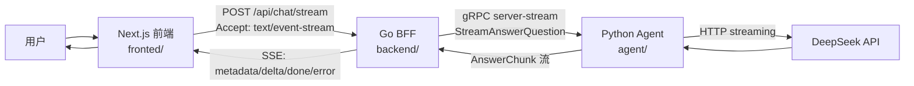

# AI Investment Assistant

这是一个用来演示 **AI 投资研究对话链路** 的多端仓库：

- `fronted/`：面向用户的 Web 前端，负责输入问题、展示流式回答。
- `backend/`：Go 写的 BFF（Backend For Frontend），负责把前端的 HTTP/SSE 请求转换成内部 gRPC 流。
- `agent/`：Python 写的 Agent 服务，负责组装 prompt、调用 DeepSeek、把结果按 chunk 流式返回。
- `proto/`：前后端与 Agent 之间共享的协议定义。

如果你想快速理解这个仓库，最重要的一句话是： 

> **前端用 HTTP POST 发起请求、用 SSE 接收流；BFF 对外讲 SSE、对内讲 gRPC stream；Agent 再把问题交给模型 provider 流式生成答案。**

***

## 1. 这份 README 主要帮你看什么

这份文档不是写给机器看的，而是写给第一次接手这个仓库的人看的。重点解释：

1. 项目当前已经实现了什么。
2. 一条消息是怎么从 **FE → server/BFF → agent → 模型 provider** 跑通的。
3. 各层分别负责什么，为什么这么拆。
4. 关键数据结构、关键事件、关键文件分别在哪里。
5. 本地如何把这三层服务跑起来。

如果你只想先抓主线，请直接看：

- [5. 一条消息从 FE 到 server 再到 agent 是怎么跑的](#5-一条消息从-fe-到-server-再到-agent-是怎么跑的)
- [6. 协议与字段流转](#6-协议与字段流转)
- [7. 本地启动方式](#7-本地启动方式)

***

## 2. 当前仓库实现到什么程度了

当前仓库的重点，是一条已经打通的 **AI 对话流式链路**：

1. 用户在首页左侧聊天面板输入问题。
2. 前端先把用户消息乐观插入消息列表。
3. 前端通过 `POST /api/chat/stream` 请求 Go BFF。
4. BFF 做基础校验、生成会话和消息 ID。
5. BFF 通过 gRPC 调 Python Agent 的 `StreamAnswerQuestion`。
6. Agent 将请求转成内部问答图输入，再调用 DeepSeek 流式生成。
7. Agent 按 `metadata`、`delta`、`done`、`error` 这四类 chunk 逐步返回。
8. BFF 把 gRPC chunk 翻译成 SSE 事件，持续推回前端。
9. 前端按事件类型更新消息状态，最终把回答完整显示出来。

换句话说，这个仓库当前最有价值的部分，不是一个“大而全”的投资平台，而是一个 **端到端流式聊天 slice**。

***

## 3. 一图看懂整体架构



这个拆法的核心好处是：

- **前端简单**：只关心页面交互和 SSE 消费。
- **BFF 清晰**：对外统一浏览器友好的协议，对内统一服务间协议。
- **Agent 可独立演进**：prompt、图逻辑、模型 provider 都可以在 Python 层单独升级。
- **协议可复用**：`proto/investment/v1/agent.proto` 可以让 Go 与 Python 保持同一套契约。

***

## 4. 目录结构怎么读

> 注意：仓库里的前端目录名是 **`fronted/`**，不是常见的 `frontend/`。这是当前仓库真实名字。

```text
.
├── fronted/                     # Next.js 前端
│   ├── app/                     # App Router 页面入口
│   └── features/ai/             # 聊天 UI、hook、SSE 客户端、类型定义
├── backend/                     # Go BFF
│   ├── cmd/bff/                 # BFF 启动入口
│   ├── internal/bff/            # 路由、请求校验、SSE 编码、gRPC client
│   └── gen/go/investment/v1/    # proto 生成的 Go 代码
├── agent/                       # Python Agent 服务
│   ├── app/server.py            # gRPC server
│   ├── app/graphs/              # 问答图逻辑
│   ├── app/providers/           # DeepSeek provider
│   └── app/gen/investment/v1/   # proto 生成的 Python 代码
├── proto/investment/v1/         # gRPC 协议定义
├── Makefile                     # 常用 proto / test / check 命令
└── .env.example                 # 示例环境变量
```

### 建议的阅读顺序

如果你是第一次看这套实现，建议按下面顺序读：

1. `fronted/features/ai/ChatPanel.tsx`
2. `fronted/features/ai/useChatStream.ts`
3. `fronted/features/ai/chat-stream-client.ts`
4. `backend/internal/bff/server.go`
5. `backend/internal/bff/chat_stream.go`
6. `backend/internal/bff/agent_grpc_client.go`
7. `proto/investment/v1/agent.proto`
8. `agent/app/server.py`
9. `agent/app/graphs/question_answer.py`
10. `agent/app/providers/deepseek.py`

***

## 5. 一条消息从 FE 到 server 再到 agent 是怎么跑的

这一节是整份 README 的核心。

***

### 5.1 页面入口：聊天面板是怎么挂到首页的

首页组件在 `fronted/app/page.tsx:12` 的 `Home()` 里渲染了 `<ChatPanel />`，真正的对话 UI 入口在 `fronted/features/ai/ChatPanel.tsx:7`。

当前页面布局大概是：

- 左侧：聊天面板 `ChatPanel`
- 中间：研究工作台（静态卡片）
- 右侧：自选股列表

其中中间区域还明确写了一句提示：页面上下文后续会作为 `pageContext` 传给 BFF，再由 gRPC streaming 转交给 Agent。这个提示就在 `fronted/app/page.tsx:90`。

这说明这条链路从设计上就不是“纯聊天”，而是 **带页面上下文的研究问答**。

***

### 5.2 用户点击“发送”后，前端先做了什么

聊天面板组件 `ChatPanel()` 在 `fronted/features/ai/ChatPanel.tsx:12` 定义了 `onSubmit()`。

它做了 3 件事：

1. 清空上一次错误。
2. 调用 `sendMessage(input, pageContext)`。
3. 如果发送成功，清空输入框。

这里的 `pageContext` 目前是**前端写死的示例值**：

```json
{
  "route": "/",
  "symbol": "AAPL",
  "eventId": "",
  "researchCardId": ""
}
```

位置见 `fronted/features/ai/ChatPanel.tsx:15`。

这代表当前版本已经把“上下文字段往后传”的链路打通了，但**页面上下文本身还不是动态收集的真实业务数据**。

***

### 5.3 前端状态核心：`useChatStream` 怎么维护消息列表

真正的前端聊天状态，不在 React Query，也不在全局 store，而是在自定义 hook `useChatStream()` 中维护，位置是 `fronted/features/ai/useChatStream.ts:11`。

这个 hook 管 3 个关键状态：

- `conversationId`：当前会话 ID，`fronted/features/ai/useChatStream.ts:12`
- `messages`：当前页面上的消息数组，`fronted/features/ai/useChatStream.ts:13`
- `abortRef`：当前请求的 `AbortController`，用于停止回答，`fronted/features/ai/useChatStream.ts:14`

#### 发送前的乐观更新

在 `sendMessage()` 里，前端会先往 `messages` 里插两条消息，位置见 `fronted/features/ai/useChatStream.ts:74`：

1. 一条用户消息，状态直接是 `completed`
2. 一条 assistant 占位消息：
   - `id: "assistant-pending"`
   - `content: ""`
   - `status: "pending"`

这样做的好处是：

- 用户一点击发送，页面立刻有反馈。
- 即使模型还没开始回 token，前端也已经有一个“AI 正在回复”的占位节点。

#### 流事件到达后的状态更新

`handleEvent()` 在 `fronted/features/ai/useChatStream.ts:16`，它把 SSE 事件映射成前端 UI 状态：

- `metadata`
  - 保存 `conversationId`
  - 把 `assistant-pending` 替换成真实的 `assistantMessageId`
  - 把状态从 `pending` 改成 `streaming`
- `delta`
  - 找到当前处于 `streaming` 的 assistant 消息
  - 把 `event.content` 追加到已有文本后面
- `done`
  - 把 `streaming` 的 assistant 消息改成 `completed`
  - 清理 `abortRef`
- `error`
  - 把当前 streaming 消息标记为 `error`
  - 如果还没收到任何正文，就直接显示错误文案

这套状态机很轻，但足够清晰：

`pending → streaming → completed`

或在异常/取消时进入：

- `error`
- `aborted`

状态定义在 `fronted/features/ai/types.ts:1`。

***

### 5.4 前端为什么不是用 `EventSource`，而是 `fetchEventSource`

前端发流式请求的封装在 `fronted/features/ai/chat-stream-client.ts:15`，函数名是 `startChatStream()`。

这里使用的是 `@microsoft/fetch-event-source`，而不是浏览器原生 `EventSource`，原因非常实际：

1. 这里需要 `POST` 请求。
2. 这里需要携带 JSON body。
3. 这里需要自定义 `Authorization` 请求头。

原生 `EventSource` 对这些场景支持很弱，而 `fetchEventSource` 可以直接基于 Fetch 能力实现 SSE 消费。

请求长这样：

```http
POST /api/chat/stream
Accept: text/event-stream
Content-Type: application/json
Authorization: Bearer local-dev
```

JSON body 由 `fronted/features/ai/useChatStream.ts:91` 组装：

```json
{
  "conversationId": "",
  "content": "帮我分析一下 AAPL 最近要关注什么风险",
  "pageContext": {
    "route": "/",
    "symbol": "AAPL",
    "eventId": "",
    "researchCardId": ""
  }
}
```

需要注意两点：

- API 地址来自 `NEXT_PUBLIC_API_BASE_URL`，默认 `http://localhost:8080`，见 `fronted/features/ai/chat-stream-client.ts:5`。
- token 目前是前端硬编码的 `local-dev`，见 `fronted/features/ai/useChatStream.ts:93`，说明现在还没有接完整登录态。

***

### 5.5 BFF 入口：`POST /api/chat/stream` 收到请求后做什么

BFF 的路由定义在 `backend/internal/bff/server.go:17` 的 `NewServer()` 里，其中聊天接口注册在 `backend/internal/bff/server.go:23`：

```go
s.router.Post("/api/chat/stream", s.handleChatStream)
```

实际处理函数是 `handleChatStream()`，位于 `backend/internal/bff/server.go:57`。

它的处理步骤非常标准，而且很适合作为 BFF 层样板：

#### 第 1 步：检查授权头

`backend/internal/bff/server.go:58` 只检查 `Authorization` 是否为空。

也就是说，当前实现还没有做真正的鉴权逻辑，只做了**存在性校验**。

#### 第 2 步：解析 JSON 请求

`decodeChatStreamRequest()` 在 `backend/internal/bff/chat_stream.go:112`。

它会：

1. 用 `json.NewDecoder(r.Body).Decode(&req)` 解码。
2. 调 `validateChatRequest(req)` 做基础校验。

校验规则在 `backend/internal/bff/chat_stream.go:58`：

- `content` 不能为空
- `content` 长度不能超过 4000 个字符

#### 第 3 步：补齐会话和消息 ID

在 `backend/internal/bff/server.go:69`：

- 如果前端没传 `conversationId`，BFF 就生成一个新的 `conversation-xxxxxxxx`
- 同时生成：
  - `userMessageID`
  - `assistantMessageID`

生成逻辑在 `backend/internal/bff/server.go:117` 的 `newID()`。

这是个很关键的设计点：

> **会话 ID 的续接由前端负责保存并回传，BFF 负责在缺省时生成新 ID。**

所以这里不是一个“后端自行维护会话上下文数据库”的系统，而是一个“前端拿着 conversationId 连续对话”的轻量实现。

***

### 5.6 BFF 为什么既像 HTTP 服务，又像协议翻译层

因为它的角色本来就是 **BFF + 协议适配层**。

对浏览器，它提供的是：

- `POST /api/chat/stream`
- `text/event-stream`
- SSE 事件名：`metadata` / `delta` / `done` / `error`

对内部 Agent，它讲的是：

- gRPC
- `StreamAnswerQuestion`
- `stream AnswerChunk`

也就是说：

> **BFF 的价值，不是“自己生成答案”，而是“把浏览器友好的流协议，翻译成服务端内部更稳定的 RPC 协议”。**

这层翻译逻辑就在 `backend/internal/bff/agent_grpc_client.go:19` 的 `StreamAnswer()`。

***

### 5.7 BFF 怎么把 HTTP 请求转成 gRPC 请求

`backend/internal/bff/server.go:76` 会把前端请求组装成 `AgentStreamRequest`：

- `UserID`
- `ConversationID`
- `UserMessageID`
- `AssistantMessageID`
- `Content`
- `PageContext`

然后交给 `s.agent.StreamAnswer(...)`。

这个 `StreamAnswer()` 的真正实现是 `backend/internal/bff/agent_grpc_client.go:19`。

在那里，BFF 会把 Go 内部结构映射成 proto 请求 `StreamAnswerQuestionRequest`：

- `UserID` → `user_id`
- `ConversationID` → `conversation_id`
- `UserMessageID` → `user_message_id`
- `AssistantMessageID` → `assistant_message_id`
- `Content` → `content`
- `PageContext.EventID` → `page_context.event_id`
- `PageContext.ResearchCardID` → `page_context.research_card_id`

gRPC 协议定义在 `proto/investment/v1/agent.proto:7`。

核心 RPC 如下：

```proto
service AgentService {
  rpc StreamAnswerQuestion(StreamAnswerQuestionRequest) returns (stream AnswerChunk);
}
```

这意味着：

- 请求是一次性的 unary request
- 响应是 server streaming

也就是“发一次问题，持续收到多个 chunk”。

***

### 5.8 BFF 收到 gRPC stream 后，为什么还要再翻一层

因为 BFF 内部不直接把 proto chunk 原样吐给浏览器，而是先映射成自己的 `AgentChunk`。

类型定义在 `backend/internal/bff/chat_stream.go:25`。

这样做的好处是：

1. BFF 内部逻辑不用到处直接依赖 proto 枚举。
2. 后续如果 Agent 协议有微调，可以把适配集中在一处改。
3. SSE 编码层只面向统一的 BFF 内部结构，不面向 proto 细节。

proto 到内部 chunk 的映射在 `backend/internal/bff/agent_grpc_client.go:59` 的 `protoChunkToAgentChunk()`。

映射规则如下：

- `ANSWER_CHUNK_TYPE_METADATA` → `AgentChunkMetadata`
- `ANSWER_CHUNK_TYPE_DELTA` → `AgentChunkDelta`
- `ANSWER_CHUNK_TYPE_DONE` → `AgentChunkDone`
- `ANSWER_CHUNK_TYPE_ERROR` → `AgentChunkError`

如果读到未知类型，会被兜底翻译成一个 `UNKNOWN_AGENT_CHUNK` 错误。

***

### 5.9 BFF 怎么把内部 chunk 编码成 SSE

SSE 编码逻辑在 `backend/internal/bff/chat_stream.go:73` 的 `chunkToSSE()`。

底层编码函数是 `encodeSSE()`，在 `backend/internal/bff/chat_stream.go:69`：

```text
event: <event-name>
data: <json>

```

#### 事件 1：`metadata`

返回：

```json
{
  "conversationId": "conversation-xxx",
  "userMessageId": "message-user-xxx",
  "assistantMessageId": "message-assistant-xxx"
}
```

#### 事件 2：`delta`

返回：

```json
{
  "content": "逐段返回的文本"
}
```

#### 事件 3：`done`

返回：

```json
{
  "finishReason": "stop"
}
```

#### 事件 4：`error`

返回：

```json
{
  "code": "DEEPSEEK_TIMEOUT",
  "message": "DeepSeek request timed out"
}
```

这里还有一个容易忽略但很重要的实现细节：

当 BFF 收到 `metadata` chunk 时，会在 `backend/internal/bff/server.go:95` 主动把这三个字段补齐：

- `conversationID`
- `userMessageID`
- `assistantMessageID`

其中 `userMessageID` 实际上不是 agent proto metadata 自带的，而是 **BFF 自己生成后补给前端** 的。

这说明 BFF 并不是“完全透传”，而是在承担 **前端所需事件格式的拼装职责**。

***

### 5.10 Agent 的 gRPC handler 做了什么

Agent 服务入口在 `agent/app/server.py:21`，类名是 `AgentServicer`。

真正的 RPC 实现是 `StreamAnswerQuestion()`，在 `agent/app/server.py:25`。

它的处理节奏非常清楚：

#### 第 1 步：先返回 metadata

一进入 handler，就先 `yield` 一个 `AnswerChunk(type=METADATA)`，位置见 `agent/app/server.py:30`。

这样前端可以尽快拿到：

- `conversation_id`
- `assistant_message_id`

并把占位消息切成正式消息。

#### 第 2 步：把 proto request 转成内部 `QuestionInput`

在 `agent/app/server.py:36`，gRPC 层会把协议对象映射成内部业务输入：

- `user_id`
- `conversation_id`
- `user_message_id`
- `assistant_message_id`
- `content`
- `page_context`

这一步的意义很大：

> **gRPC handler 只做协议层转换，不直接承载业务逻辑。**

#### 第 3 步：调用问答图流式生成

`async for content in self.graph.stream(graph_input)` 见 `agent/app/server.py:46`。

每拿到一段文本，就返回一个 `DELTA` chunk。

#### 第 4 步：正常结束时发 `DONE`

在 `agent/app/server.py:53`，会发送 `finish_reason="stop"` 的 done chunk。

#### 第 5 步：异常时发 `ERROR`

当前有两类明确异常映射：

- `DeepSeekError` → 透出 provider 定义的错误码，见 `agent/app/server.py:59`
- `ValueError` → 转成 `INVALID_ARGUMENT`，见 `agent/app/server.py:67`

所以 agent 对外暴露的 chunk 顺序是：

```text
metadata → delta* → done
```

或者在失败时：

```text
metadata → error
```

***

### 5.11 Agent 内部的“图”其实做了哪些事情

真正的问答逻辑在 `agent/app/graphs/question_answer.py:51` 的 `QuestionAnswerGraph`。

它并不复杂，但结构很干净：

#### 节点 1：校验输入

`_validate_input()` 在 `agent/app/graphs/question_answer.py:62`。

规则和 BFF 保持一致：

- `content.strip()` 不能为空
- 长度不能超过 4000

这相当于做了第二层防线。

#### 节点 2：拼模型 messages

`_build_messages()` 在 `agent/app/graphs/question_answer.py:70`。

它会构造两条消息：

1. system prompt
2. user prompt

system prompt 由 `_build_system_prompt()` 生成，见 `agent/app/graphs/question_answer.py:32`，核心约束包括：

- 你是投资研究助手
- 不直接给买入卖出等交易指令
- 回答要说明依据、风险和不确定性
- 回答末尾必须包含：`非投资建议，仅供研究参考`

user prompt 则会把页面上下文和用户问题合并，位置见 `agent/app/graphs/question_answer.py:72`：

```text
页面上下文：route=/；symbol=AAPL；event_id=；research_card_id=

问题：帮我分析一下 AAPL 最近要关注什么风险
```

这说明页面上下文并不是另开一个隐藏字段送给模型，而是被直接转成自然语言上下文，拼进 user message。

#### 输出阶段：流式透传 provider 内容

`stream()` 在 `agent/app/graphs/question_answer.py:79`。

它会：

1. 运行图，拿到 `messages`
2. 调 `self.provider.stream_chat(state["messages"])`
3. 持续 `yield` provider 返回的文本 chunk
4. 最后检查回答里是否已有免责声明
5. 如果没有，就自动补一段：`非投资建议，仅供研究参考`

这一步非常实用：

> **即使模型漏了免责声明，系统也会在末尾兜底补上。**

***

### 5.12 DeepSeek provider 到底负责什么

DeepSeek provider 在 `agent/app/providers/deepseek.py:61`。

它主要做四类事情：

#### 1）准备请求

在 `agent/app/providers/deepseek.py:78`，会构造：

- `model`
- `messages`
- `stream: true`
- `temperature: 0.2`

#### 2）发起流式 HTTP 请求

在 `agent/app/providers/deepseek.py:89`，使用 `httpx.AsyncClient().stream()` 请求：

```text
POST {base_url}/chat/completions
```

#### 3）把 DeepSeek 的流式返回解析成纯文本 chunk

解析函数是 `parse_stream_line()`，在 `agent/app/providers/deepseek.py:32`。

它会：

- 忽略空行
- 只处理 `data: ...` 开头的行
- 跳过 `[DONE]`
- 解析 JSON
- 从 `choices[0].delta.content` 提取文本

也就是说，**provider 层负责把模型厂商的原始流式协议翻译成 agent 能直接消费的纯文本片段**。

#### 4）统一错误语义

这里定义了多类错误：

- `DEEPSEEK_AUTH_FAILED`
- `DEEPSEEK_RATE_LIMITED`
- `DEEPSEEK_TIMEOUT`
- `DEEPSEEK_STREAM_INTERRUPTED`
- `DEEPSEEK_BAD_RESPONSE`

这些错误最终会被 agent 转成 `ERROR` chunk，再被 BFF 转成 SSE `error` 事件，再由前端显示出来。

这就形成了一个比较完整的错误传播链。

***

## 6. 协议与字段流转

这一节专门回答一个常见问题：

> “同一个字段在 FE、Go、proto、Python 里名字都一样吗？”

答案是：**语义一致，但命名风格会按语言习惯变化。**

***

### 6.1 请求字段流转

| 语义      | 前端 JSON                      | Go BFF                       | proto                           | Agent 内部                           |
| ------- | ---------------------------- | ---------------------------- | ------------------------------- | ---------------------------------- |
| 会话 ID   | `conversationId`             | `ConversationID`             | `conversation_id`               | `conversation_id`                  |
| 用户消息 ID | 前端不传                         | `UserMessageID`              | `user_message_id`               | `user_message_id`                  |
| 助手消息 ID | 前端不传                         | `AssistantMessageID`         | `assistant_message_id`          | `assistant_message_id`             |
| 提问内容    | `content`                    | `Content`                    | `content`                       | `content`                          |
| 路由      | `pageContext.route`          | `PageContext.Route`          | `page_context.route`            | `page_context["route"]`            |
| 股票代码    | `pageContext.symbol`         | `PageContext.Symbol`         | `page_context.symbol`           | `page_context["symbol"]`           |
| 事件 ID   | `pageContext.eventId`        | `PageContext.EventID`        | `page_context.event_id`         | `page_context["event_id"]`         |
| 研报卡片 ID | `pageContext.researchCardId` | `PageContext.ResearchCardID` | `page_context.research_card_id` | `page_context["research_card_id"]` |

核心要点：

- **前端只负责传** **`conversationId`、`content`、`pageContext`**。
- **消息 ID 由 BFF 生成**。
- **Agent 只消费已经标准化后的请求，不自己发号。**

***

### 6.2 流事件语义

前端统一事件类型定义在 `fronted/features/ai/types.ts:30`。

共有 4 种：

#### `metadata`

表示“本次回答已经正式建立上下文”。

用途：

- 落 `conversationId`
- 把 `assistant-pending` 替换成真实消息 ID

#### `delta`

表示“又来了一小段文本”。

用途：

- 追加到 assistant 当前消息尾部

#### `done`

表示“这次回答正常结束了”。

用途：

- 把当前回答状态置为 `completed`

#### `error`

表示“本次回答失败了”。

用途：

- 把当前回答状态置为 `error`
- 让 UI 能显示错误信息

***

### 6.3 前端如何解析 SSE 事件

前端并不是在组件里直接写一堆 `if (eventName === ...)`，而是专门做了一层解析器：`parseChatStreamEvent()`，位置见 `fronted/features/ai/chat-event-parser.ts:10`。

它会把浏览器收到的 SSE 原始事件：

- `message.event`
- `message.data`

转成统一的 `ChatStreamEvent`。

这层的价值是：

1. 组件/Hook 不关心原始 SSE 文本格式。
2. 如果未来事件名或 payload 变化，改解析器即可。
3. 测试粒度更清晰。

***

## 7. 本地启动方式

这一节的目标不是“最优雅”，而是“让你最快把链路跑起来”。

***

### 7.1 先决条件

从仓库当前配置推断，建议准备：

- Node.js 20+
- `pnpm` 10+
- Go 1.26
- Python 3.12+

参考依据：

- 前端 `packageManager` 在 `fronted/package.json:5`
- Go 版本在 `backend/go.mod:3`
- Python 版本在 `agent/pyproject.toml:4`

***

### 7.2 环境变量

仓库根目录有 `.env.example`，可作为本地变量参考。

重点变量：

- `DEEPSEEK_API_KEY`
- `DEEPSEEK_BASE_URL`
- `DEEPSEEK_MODEL`
- `DEEPSEEK_TIMEOUT_SECONDS`
- `AGENT_GRPC_ADDR`
- `AGENT_GRPC_BIND_ADDR`
- `NEXT_PUBLIC_API_BASE_URL`

其中：

- BFF 连接 agent 用的是 `AGENT_GRPC_ADDR`，默认值见 `.env.example:23`
- Agent 自己监听地址用的是 `AGENT_GRPC_BIND_ADDR`，默认值见 `.env.example:24`
- 前端访问 BFF 用的是 `NEXT_PUBLIC_API_BASE_URL`，默认值见 `.env.example:25`

> 建议你把 `.env.example` 里的 `DEEPSEEK_API_KEY` 替换成你自己的真实密钥，不要直接把示例值当成正式配置使用。

前端自己的本地环境变量示例在 `fronted/.env.local.example`。

***

### 7.3 Terminal 1：启动 Agent

```bash
cd agent
python -m pip install -e ".[dev]"
DEEPSEEK_API_KEY="你的 key" python -m app.server
```

Agent 启动后会监听 `AGENT_GRPC_BIND_ADDR`，默认是 `127.0.0.1:9010` 或 `[::]:9010`，取决于你的环境变量配置，代码见 `agent/app/config.py:14` 和 `agent/app/server.py:77`。

***

### 7.4 Terminal 2：启动 Go BFF

```bash
cd backend
AGENT_GRPC_ADDR=127.0.0.1:9010 go run ./cmd/bff
```

启动入口在 `backend/cmd/bff/main.go:13`。

它会：

1. 读取 `AGENT_GRPC_ADDR`
2. 建立到 agent 的 gRPC 连接
3. 启动 HTTP 服务在 `:8080`

本地健康检查接口：

```bash
curl http://localhost:8080/healthz
```

路由定义见 `backend/internal/bff/server.go:24`。

***

### 7.5 Terminal 3：启动前端

```bash
cd fronted
pnpm install
cp .env.local.example .env.local
pnpm dev
```

默认会跑在 `http://localhost:3000`，脚本见 `fronted/package.json:7`。

确保 `.env.local` 中的：

```text
NEXT_PUBLIC_API_BASE_URL=http://localhost:8080
```

这样前端就会把请求打到本地 BFF。

***

### 7.6 你应该如何手动验证链路

打开 `http://localhost:3000` 后，可以直接在聊天框里输入类似问题：

```text
帮我分析一下 AAPL 最近需要重点关注哪些风险？
```

预期现象：

1. 页面先出现一条用户消息。
2. 紧接着出现一条 assistant 占位消息（还没内容）。
3. 几百毫秒后 assistant 文本开始逐段增长。
4. 回答结束后，assistant 状态从 `streaming` 变成 `completed`。
5. 回答末尾应该能看到：`非投资建议，仅供研究参考`。

***

## 8. 常用验证命令

仓库根目录 `Makefile` 已经把这个聊天 slice 的常用命令整理好了。

### 8.1 生成 proto 代码

```bash
make proto
```

对应 `Makefile:15`。

这个命令会：

- 用 `buf` 生成 Go 代码
- 用 `grpc_tools.protoc` 生成 Python 代码

也就是说：

> **只要你改了** **`proto/investment/v1/agent.proto`，就应该重新跑一次** **`make proto`。**

***

### 8.2 跑各层测试

```bash
make test-agent
make test-backend
make test-fronted
```

对应：

- `Makefile:28`
- `Makefile:31`
- `Makefile:35`

如果你只想做一次性完整检查，可以跑：

```bash
make check-chat-slice
```

对应 `Makefile:38`，它会串行执行：

- proto 生成
- agent 测试
- backend 测试
- fronted 检查

前端内部的 `check` 脚本定义在 `fronted/package.json:14`，实际会跑：

- lint
- typecheck
- test
- build

***

## 9. 关键文件速查表

### 前端

- `fronted/app/page.tsx:12`
  - `Home()`：首页布局，把 `ChatPanel` 挂到页面上。
- `fronted/features/ai/ChatPanel.tsx:7`
  - `ChatPanel()`：聊天 UI 主组件。
- `fronted/features/ai/ChatPanel.tsx:12`
  - `onSubmit()`：读取输入、组装 `pageContext`、调用发送逻辑。
- `fronted/features/ai/useChatStream.ts:11`
  - `useChatStream()`：聊天状态核心 hook。
- `fronted/features/ai/useChatStream.ts:16`
  - `handleEvent()`：按 `metadata/delta/done/error` 更新 UI。
- `fronted/features/ai/useChatStream.ts:63`
  - `sendMessage()`：乐观插入消息并发起流。
- `fronted/features/ai/useChatStream.ts:118`
  - `stop()`：中止当前流式回答。
- `fronted/features/ai/chat-stream-client.ts:15`
  - `startChatStream()`：用 `fetchEventSource` 发起 POST + SSE 请求。
- `fronted/features/ai/chat-event-parser.ts:10`
  - `parseChatStreamEvent()`：把 SSE 事件解析成前端统一类型。

### BFF

- `backend/cmd/bff/main.go:13`
  - `main()`：BFF 进程启动入口。
- `backend/internal/bff/server.go:17`
  - `NewServer()`：注册路由和中间件。
- `backend/internal/bff/server.go:57`
  - `handleChatStream()`：聊天请求主处理函数。
- `backend/internal/bff/chat_stream.go:58`
  - `validateChatRequest()`：基础输入校验。
- `backend/internal/bff/chat_stream.go:73`
  - `chunkToSSE()`：内部 chunk → SSE 文本。
- `backend/internal/bff/agent_grpc_client.go:19`
  - `StreamAnswer()`：BFF → agent 的 gRPC 调用桥接。
- `backend/internal/bff/agent_grpc_client.go:59`
  - `protoChunkToAgentChunk()`：proto chunk → BFF chunk。

### Agent

- `agent/app/server.py:25`
  - `StreamAnswerQuestion()`：agent 的 gRPC streaming handler。
- `agent/app/graphs/question_answer.py:51`
  - `QuestionAnswerGraph`：输入校验、构造 prompt、调用 provider。
- `agent/app/graphs/question_answer.py:79`
  - `stream()`：流式产出回答，并保证免责声明存在。
- `agent/app/providers/deepseek.py:61`
  - `DeepSeekProvider`：DeepSeek 模型调用封装。
- `agent/app/providers/deepseek.py:32`
  - `parse_stream_line()`：解析 DeepSeek 流式返回格式。

### 协议

- `proto/investment/v1/agent.proto:7`
  - `AgentService.StreamAnswerQuestion`：BFF 与 Agent 的共享协议。

***

## 10. 这个实现有哪些值得注意的设计点

### 10.1 对外 SSE、对内 gRPC，是一个很实用的组合

浏览器消费 SSE 比直接消费 gRPC 容易得多，而服务之间用 gRPC stream 又比自定义 SSE 协议更稳定。

所以这里的组合非常合理：

- **浏览器层友好**：SSE
- **服务层规范**：gRPC streaming

***

### 10.2 BFF 没有“发明业务”，但承担了关键的边界职责

它负责：

- 接住浏览器协议
- 生成消息 ID
- 保持事件格式稳定
- 统一错误出口
- 让前端不用理解 proto 细节

这正是一个好 BFF 该做的事。

***

### 10.3 Agent 的 gRPC 层和业务层是分离的

`agent/app/server.py:25` 只负责：

- 收 proto 请求
- 回 proto chunk

真正业务逻辑在 `agent/app/graphs/question_answer.py:51`。

这样以后不管你是从 gRPC 进、HTTP 进、消息队列进，都可以复用同一套图逻辑。

***

### 10.4 免责声明不是“提示语建议”，而是系统兜底规则

`agent/app/graphs/question_answer.py:86` 明确保证：

- 如果最终回答里没有 `非投资建议，仅供研究参考`
- 系统会自动补上

这比“只在 prompt 里提醒模型”更稳。

***

### 10.5 当前版本仍然是一个偏 demo / slice 的实现

虽然链路已经跑通，但仍有一些明显是“下一步再补”的点：

1. 前端 token 还是 `local-dev` 硬编码，见 `fronted/features/ai/useChatStream.ts:93`
2. BFF 只检查 `Authorization` 是否存在，没有真实鉴权
3. `pageContext` 目前主要是前端写死示例值，不是动态采集
4. 会话状态目前主要依赖前端保存并回传 `conversationId`
5. BFF 连接 agent 目前使用的是 insecure gRPC，见 `backend/cmd/bff/main.go:18`

也正因为这些“复杂能力”还没进来，所以这份代码非常适合拿来学习流式链路本身。

***

## 11. 如果你后续要继续扩展，建议从哪里下手

### 方向 1：把 `pageContext` 变成真实页面上下文

当前最自然的升级点，就是把 `ChatPanel` 里写死的：

- `route`
- `symbol`
- `eventId`
- `researchCardId`

改成真正从页面状态、路由参数、选中卡片中采集。

***

### 方向 2：补上真实用户态和鉴权

建议让：

- 前端从登录态拿 token
- BFF 校验 token 并解析真实 `user_id`
- Agent 使用真实用户身份做后续审计或个性化逻辑

***

### 方向 3：让 Agent 不只是“单轮拼 prompt”

现在的 `QuestionAnswerGraph` 主要是：

- 校验输入
- 拼 system/user message
- 直接调 provider

后续可以加入：

- 检索股票/事件上下文
- 调研报服务
- 引用市场数据
- 输出结构化结论卡片

***

### 方向 4：做更完整的可观测性

例如补充：

- BFF 请求日志
- Agent 每轮调用耗时
- provider 错误码统计
- 前端每条会话的 trace id

这样当流式回答异常中断时，就更容易排查到底断在 FE、BFF、Agent 还是模型厂商。

***

## 12. 最后，用一句人话总结这套实现

如果要把这套实现讲给同事听，可以直接说：

> 这个仓库现在最核心的能力，是把“浏览器里的一个聊天输入框”，通过 Go BFF 转成 Python Agent 的 gRPC 流，再把模型输出按 SSE 一段一段推回页面；前端只负责展示，BFF 负责协议翻译，Agent 负责 prompt 与模型调用。

这就是当前版本最重要的主线。
