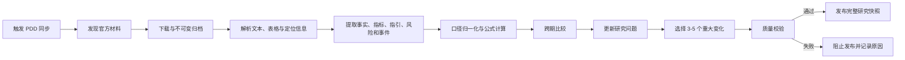
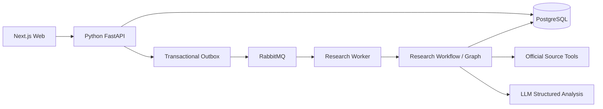

# 公司研究跟踪工作台项目设计

> 日期：2026-06-07
>
> 状态：产品与领域架构基线
>
> MVP 样板公司：拼多多（NASDAQ: PDD）

## 1. 文档目的

本文档定义 AI 投资助手下一阶段的完整产品边界、自动采集与分析链路、领域模型、页面信息架构、质量门槛和实施顺序。

当本文档与以下旧方向冲突时，以本文档为准：

- 以聊天为产品主入口。
- 以行情、新闻流、选股或综合评分为核心。
- 第一版同时覆盖多家公司。
- 第一版先做静态页面，再补自动采集与分析。
- 依赖用户手工整理财务数据作为系统输入。

当前目标不是直接开始写页面，而是先跑通一条可信的公司研究生产链路，再把结构化产物展示为研究工作台。

## 2. 产品定义

### 2.1 一句话定位

一个面向个人研究者的公司持续跟踪工作台：自动获取公司财报和官方信息，识别经营变化，更新研究判断，并让每个数据和结论都可追溯到原始证据。

### 2.2 用户要完成的核心任务

用户打开一家熟悉公司的页面后，应在 10 分钟内弄清楚：

1. 最新一期发生了哪些重要变化。
2. 原有研究判断是否需要改变。
3. 管理层的明确指引是否兑现。
4. 主要风险是新增、加剧、缓解还是不变。
5. 下一期需要验证什么。
6. 每个结论由哪些官方材料支持。

### 2.3 目标用户

第一版面向：

- 已经熟悉目标公司的个人研究者。
- 理解收入、利润率、现金流等基本概念。
- 没有时间完整阅读每份财报和公告。
- 希望自己形成判断，而不是获得买卖建议。

### 2.4 产品不是

本产品不是：

- 投资建议工具。
- 选股器或股票排行榜。
- 行情终端。
- AI 预测器。
- 财报摘要生成器。
- 以自由对话为核心的通用金融聊天机器人。

## 3. 第一性原则

### 3.1 研究对象是公司，不是文档

财报、公告和业绩会材料只是证据。系统应围绕研究问题组织信息，而不是按文件逐份生成摘要。

### 3.2 持续跟踪的价值来自“变化”

页面不能只展示最新结论。它必须保留历史快照，并回答：

- 上一期判断是什么。
- 本期新增了什么证据。
- 判断为什么改变或为什么不变。
- 上一期验证条件是否得到验证。

### 3.3 事实、推算和判断必须分层

系统固定使用四种证据标签：

| 标签 | 定义 |
| --- | --- |
| 官方披露 | 公司或监管机构直接披露的事实与数据 |
| 公式推算 | 仅使用官方数据、通过明确公式得到的结果 |
| 分析判断 | 基于事实和推算形成、但不等同于官方表述的判断 |
| 信息未披露 | 当前官方材料不足以支持精确结论 |

### 3.4 不完整比伪完整更可信

遇到缺失、冲突或不可比数据时，系统必须输出“证据不足”“暂不可比”或“信息未披露”，不能为了生成完整报告而猜测。

### 3.5 强制步骤属于 Workflow

来源发现、材料归档、数据校验、跨期比较、引用检查和发布门槛必须由确定性的 Workflow/Graph 控制。

LLM 只用于：

- 语义提取。
- 表述归类。
- 原因分析。
- 证据支持度判断。
- 研究文字生成。

LLM 无权跳过任何强制步骤，也不能自行决定基于残缺材料发布正式快照。

## 4. MVP 边界

### 4.1 MVP 必须完成

- 只支持拼多多 `PDD`。
- 自动发现并归档官方材料。
- 覆盖近 3 年年度数据。
- 覆盖最近 8 个季度。
- 跟踪两次财报之间的重大官方事件。
- 提取通用指标和公司特有指标。
- 识别管理层明确、可验证的指引。
- 识别风险变化。
- 维护固定的研究问题。
- 生成不可变的历史研究快照。
- 所有重要数据和结论提供具体引用。
- 提供桌面端公司跟踪总览页。
- 提供受当前公司证据约束的辅助问答入口。

### 4.2 MVP 明确不做

- 股价与实时行情。
- 估值、目标价和预期收益。
- 买入、卖出、加仓、减仓、仓位建议。
- AI 收入或利润预测。
- 分析师预期。
- 媒体新闻和第三方数据库。
- 第三方业务数据估算。
- 同行排名和标准化横向比较。
- 综合评分。
- 自动交易和券商接入。
- 移动端专属交互。
- 业绩会音频自动转写。
- 外部消息推送。
- 一开始适配全部美股和港股。

### 4.3 扩展性边界

MVP 的运行配置只包含 `PDD`，但以下结构不能写死拼多多：

- 公司与证券标识。
- 官方来源适配器。
- 指标定义。
- 业务分部和地区维度。
- 研究问题模板。
- 报告期和币种。

这里的扩展性只要求数据结构可承载第二家公司，不要求 MVP 实现第二家公司。

## 5. 拼多多默认研究问题

MVP 固定跟踪以下五个问题：

1. 海外业务投入是否带来可持续增长？
2. 收入增长的主要驱动力是否发生变化？
3. 高投入对利润率和现金流造成什么影响？
4. 管理层明确指引是否兑现？
5. 海外监管与合规风险是否加剧？

每个研究问题必须包含：

- 当前状态：改善、恶化、基本不变、证据不足。
- 当前判断。
- 本期变化。
- 支持证据。
- 反对证据。
- 尚未披露的信息。
- 下期验证条件。
- 用户自己的判断和备注。
- 证据引用。

官方未单独披露海外收入时：

- 明确显示“公司未单独披露”。
- 可以使用官方披露指标做可复核的公式推算。
- 不允许用营销费用、管理层语气等非唯一关系倒推出海外收入。
- 只能输出方向性分析时，必须标记为“分析判断”。

## 6. 官方来源边界

### 6.1 来源优先级

1. 监管披露：SEC 文件；后续港股扩展使用港交所披露。
2. 公司财报、业绩公告和投资者材料。
3. 公司官网发布的正式公告。
4. 公司官方提供的业绩会文本。
5. 管理层官方采访只作补充，不作为核心数字依据。

MVP 不纳入媒体报道、卖方研报、聚合数据库和第三方估算。

### 6.2 PDD 首期材料范围

- SEC `20-F` 年报。
- SEC 中与季度业绩相关的 `6-K`。
- 公司财报新闻稿。
- 公司投资者关系页面材料。
- 存在官方文本时的业绩会材料。
- 会改变经营判断的其他重大官方公告。

### 6.3 来源覆盖清单

每次更新必须生成来源覆盖清单：

- 预期应有的材料。
- 已成功获取的材料。
- 未获取的材料。
- 失败原因。
- 最后检查时间。
- 缺失材料对分析范围的影响。

关键监管文件缺失时禁止发布正式更新。补充材料缺失时可以发布，但必须标记“分析范围受限”。

### 6.4 来源冲突规则

- 监管披露优先于公司新闻稿和演示材料。
- 后续更正或重述优先于旧版本。
- 旧值不能被删除，必须保留版本和更正记录。
- 无法确定哪个值有效时，不自动选择，必须展示冲突并阻止相关结论发布。

## 7. 自动采集与分析链路

### 7.1 总体流程



### 7.2 阶段一：来源发现

输入：

- 公司标识。
- 已知官方来源配置。
- 上次同步时间。

输出：

- 候选材料列表。
- 材料类型。
- 发布时间和报告期。
- 官方 URL。
- 是否已归档。

要求：

- 同一个官方文件重复发现时必须幂等。
- 只允许配置中的官方域名和监管来源进入主证据链。
- 手动补充入口只接受官方链接，并重新执行来源校验。

### 7.3 阶段二：原始材料归档

原始材料一经获取即不可修改。每个版本保存：

- 原始 URL。
- 下载时间。
- 内容哈希。
- MIME 类型。
- 原始文件或对象存储引用。
- 发布日期。
- 报告期。
- 来源类型。
- 是否为更正版本。

相同哈希不重复归档；相同 URL 内容变化时创建新版本。

### 7.4 阶段三：文档解析

解析产物必须保留可定位信息：

- 章节。
- 页码。
- 表格和行列位置。
- 段落或文本跨度。
- 原文。
- 中文翻译。

翻译仅用于阅读，原文才是最终核验依据。

### 7.5 阶段四：结构化提取

提取对象分为五类：

1. 财务与经营指标。
2. 管理层解释。
3. 明确、可验证的管理层指引。
4. 风险因素及其变化。
5. 重大官方事件。

每条提取结果都必须带：

- 对应报告期。
- 数值、单位和币种，若适用。
- 业务分部或地区维度，若适用。
- 证据引用。
- 提取方式。
- 提取版本。

### 7.6 阶段五：口径归一化

系统必须区分：

- 年度、季度和累计期间。
- 期末值和期间流量。
- 原始币种和展示币种。
- GAAP/IFRS 与公司自定义指标。
- 公司整体、业务分部和地区。
- 原始值和公式推算值。

口径变化时：

- 变化前后分别保存。
- 标记不可直接比较的期间。
- 禁止强行绘制连续趋势线。
- 只有公司提供重述数据时才允许回填历史口径。

### 7.7 阶段六：确定性计算

公式推算必须由代码执行，不由 LLM 心算。

每个推算结果保存：

- 公式标识和公式版本。
- 输入值。
- 输入值证据。
- 计算结果。
- 单位和精度。
- 是否为近似值。

允许的例子：

- 同比增速。
- 利润率。
- 费用率。
- 自由现金流。
- 明确分项之和或之差。

不允许的例子：

- 根据营销费用增长倒推海外收入。
- 根据管理层语气推算业务规模。
- 根据非唯一关系补齐未披露分部数据。

### 7.8 阶段七：跨期比较

默认比较范围：

- 最近 3 个完整年度。
- 最近 8 个季度。
- 当前期与上年同期。
- 适合环比的指标才比较上一季度。

每项核心指标输出：

- 当前值。
- 同比变化。
- 可用时的环比变化。
- 连续季度趋势。
- 公司官方解释。
- AI 对官方解释的验证结果。

AI 只有在同一报告期存在可交叉验证的官方指标时，才能把管理层解释标记为“数据支持”或“数据不支持”；否则统一标记“暂无法验证”。

### 7.9 阶段八：研究问题更新

每个问题的分析固定分三层：

1. **发生了什么**：官方数据或事实。
2. **管理层怎么解释**：管理层表述及引用。
3. **AI 如何判断**：解释是否与数据一致、其他可能原因、未知信息。

问题状态只允许：

- `improving`：改善。
- `deteriorating`：恶化。
- `unchanged`：基本不变。
- `insufficient_evidence`：证据不足。

禁止使用：

- 看多、看空。
- 买入、卖出。
- 值得投资、不值得投资。

### 7.10 阶段九：重大变化筛选

首屏只展示 3-5 个变化，按以下优先级选择：

1. 改变已有研究判断。
2. 直接影响用户置顶问题。
3. 显著改变核心经营指标或风险。
4. 管理层明确指引兑现或落空。

数值变化较大但不改变经营理解的项目不进入首屏。

### 7.11 阶段十：质量校验与发布

正式快照发布前必须同时满足：

- 最新关键监管文件已获取。
- 财报新闻稿已获取。
- 来源覆盖清单已生成。
- 核心财务数据一致性校验通过。
- 所有重要数字都有证据。
- 所有重要判断都有支持证据。
- 公式推算可重放。
- 缺失信息和不可比口径已标记。
- 没有被表达为事实的无依据推断。
- 没有投资建议、估值或目标价。

校验失败时：

- 不发布半成品正式快照。
- 保留失败运行和中间产物。
- 明确显示失败阶段与原因。
- 修复后从可复用检查点重跑。

## 8. 更新与快照模型

### 8.1 触发方式

MVP 支持：

- 用户手动触发同步。
- 定时检查官方来源。
- 用户补充官方链接后重跑。

### 8.2 更新语义

发现新材料后，系统可以只重算受影响部分，但最终必须发布一份完整快照。

正式快照不可变，包含：

- 数据截止时间。
- 本次使用的全部来源版本。
- 指标与推算结果。
- 研究问题状态。
- 重大变化。
- 指引兑现情况。
- 风险变化。
- 重大事件。
- 下期验证条件。
- 当时的用户判断和备注引用。

新快照不能覆盖旧快照。

### 8.3 无重要变化

没有新财报或重大事件时：

- 保留最新正式快照。
- 显示“自上次更新后暂无重要官方变化”。
- 继续展示待验证事项。
- 显示下一预计披露节点。
- 不重复生成无意义分析。

## 9. 管理层指引追踪

只追踪同时满足以下条件的表述：

- 有明确指标或事项。
- 有目标、范围或方向。
- 有时间范围。
- 后续官方材料可以验证。

每条指引保存：

- 原始表述。
- 中文翻译。
- 指标或事项。
- 目标。
- 时间范围。
- 来源。
- 本期实际结果。
- 状态：兑现、部分兑现、未兑现、暂不可验证。
- 评价证据。

“我们对市场充满信心”等模糊表态不进入指引追踪。

## 10. 风险与事件跟踪

### 10.1 风险变化

核心页面只突出：

- 新增风险。
- 正在加剧的风险。
- 已缓解的风险。
- 状态不变但仍影响置顶问题的风险。

每项风险说明：

- 风险事实。
- 相比上一期的变化。
- 影响的研究问题。
- 当前分析判断。
- 官方证据。

完整风险披露只提供原文入口，不复制到核心页面。

### 10.2 财报间重大事件

只纳入会改变经营判断的官方事件：

- 监管公告。
- 重大收购或出售。
- 融资和回购。
- 管理层变动。
- 重大业务调整。

普通宣传新闻稿不进入核心事件流。

## 11. 页面信息架构

### 11.1 页面范围

MVP 只实现一个核心页面：

`/companies/PDD`

详细业务、财务、事件、历史和证据先作为总览中的展开区或抽屉，不立即拆成五个完整子页面。

### 11.2 桌面布局

以 `1440px` 桌面端为主要设计目标：

- 左栏：研究问题导航。
- 中栏：公司跟踪总览。
- 右栏：证据抽屉，默认收起。

移动端第一版只保证内容基本可读，不设计专属交互。

### 11.3 左栏

左栏只展示研究问题，不混入普通页面目录。

每项显示：

- 问题标题。
- 当前状态。
- 是否有本期变化。
- 是否未读。
- 是否用户置顶。

排序规则：

1. 用户置顶。
2. 本期判断发生变化。
3. 出现重要新证据。
4. 长期未更新。

用户手动排序后，系统更新不能覆盖手动顺序。

点击问题：

- 当前页滚动并聚焦对应卡片。
- 更新 URL 锚点。
- 不切换页面。

### 11.4 中栏模块顺序

1. 公司状态栏。
2. 本期 3-5 个重大变化。
3. 判断变化摘要。
4. 用户置顶研究问题。
5. 其他研究问题。
6. 管理层指引追踪。
7. 风险变化。
8. 财报间重大事件。
9. 核心经营指标。
10. 原始财务数据。

### 11.5 公司状态栏

展示：

- 公司名称、股票代码和市场。
- 当前快照报告期。
- 数据截止时间。
- 最新官方披露。
- 页面更新状态。
- 来源覆盖状态。
- 历史报告期选择器。
- “与上一期对比”开关。

### 11.6 重大变化卡片

默认展示：

- 一句话变化结论。
- 关键数字前后对比。
- 涉及的研究问题。
- 是否改变原判断。
- 证据类型。
- 一句话原因。

展开后显示：

- 迷你趋势图。
- 发生了什么。
- 管理层解释。
- AI 判断。
- 完整证据链入口。

### 11.7 研究问题卡片

默认展开：

- 当前状态。
- AI 当前判断。
- 本期变化。
- 下期验证条件。

默认折叠：

- 支持证据。
- 反对证据。
- 未知信息。
- 历史判断变化。

用户可以：

- 标记已读。
- 置顶。
- 增删自定义研究问题。
- 添加“我的判断”和备注。
- 修改、删除或补充 AI 建议的下期验证条件。

用户不能直接修改 AI 判断。AI 判断和用户判断并列保存。

### 11.8 管理层指引、风险和事件

三类模块统一使用状态化列表：

- 本期状态。
- 相比上一期的变化。
- 影响的问题。
- 证据入口。

默认只展示发生变化或与置顶问题有关的条目。

### 11.9 核心经营指标

通用指标候选：

- 营业收入。
- 毛利率。
- 经营利润率。
- 净利率。
- 经营现金流。
- 自由现金流。
- 资本支出。
- 现金与负债。
- 股份数量、回购和股权激励。

公司特有指标必须满足：

- 来自官方持续披露。
- 口径可追踪。
- 能帮助回答至少一个研究问题。

分部和地区数据只在公司持续披露时展示。未披露时不能生成虚构拆分。

### 11.10 原始财务数据

作为可展开区域提供：

- 利润表。
- 资产负债表。
- 现金流量表。
- 原始披露口径。
- 单位。
- 口径变化说明。

完整报表用于核验，不抢占核心页面。

### 11.11 历史快照对比

顶部报告期选择器切换后，整页恢复当期状态。

“与上一期对比”在原位置展示差异：

- 新增。
- 删除。
- 改善。
- 恶化。
- 不变。

旧内容弱化，新内容高亮。不做整页左右双栏对照。

### 11.12 证据抽屉

点击“查看证据”后，右栏先展示当前结论的完整证据链：

- 支持证据。
- 反对证据。
- 未知信息。

点击具体证据后展示：

- 原文片段。
- 中文翻译。
- 文件名称。
- 发布日期。
- 报告期。
- 章节或页码。
- 原始链接。
- 证据类型。
- 若为推算，展示公式和输入值。

## 12. 辅助 AI 对话

AI 对话是辅助入口，不是主页面。

它可以：

- 回答当前公司相关问题。
- 对比不同报告期。
- 解释某个指标或变化。
- 检查用户判断是否得到新证据支持。
- 把用户问题转换成新的研究问题候选。

约束：

- 只能使用当前公司的已归档官方材料。
- 回答必须带引用。
- 超出证据范围必须明确说不知道。
- 聊天发现不能自动写入正式研究档案。
- 用户确认“加入跟踪”后，才创建研究问题并重新运行结构化分析。

## 13. 领域数据模型

以下是逻辑模型，不要求一次性创建所有物理表。实施时按工作流依赖逐步落地。

### 13.1 公司与证券

`companies`

- `id`
- `legal_name`
- `display_name`
- `country`
- `fiscal_year_end`

`securities`

- `id`
- `company_id`
- `symbol`
- `exchange`
- `market`
- `currency`
- `regulator_company_id`

### 13.2 来源与归档

`source_documents`

- `id`
- `company_id`
- `source_type`
- `title`
- `official_url`
- `published_at`
- `period_start`
- `period_end`
- `period_type`
- `status`

`source_document_versions`

- `id`
- `source_document_id`
- `content_hash`
- `raw_content_ref`
- `mime_type`
- `retrieved_at`
- `supersedes_version_id`

`source_coverage_checks`

- `id`
- `company_id`
- `analysis_run_id`
- `expected_sources`
- `retrieved_sources`
- `missing_sources`
- `impact`
- `checked_at`

### 13.3 证据与结构化事实

`evidence_spans`

- `id`
- `document_version_id`
- `section`
- `page`
- `table_locator`
- `text_start`
- `text_end`
- `original_text`
- `translated_text`

`metric_definitions`

- `id`
- `code`
- `name`
- `category`
- `value_type`
- `calculation_policy`

`metric_observations`

- `id`
- `company_id`
- `metric_definition_id`
- `period_start`
- `period_end`
- `period_type`
- `value`
- `unit`
- `currency`
- `segment`
- `region`
- `evidence_span_id`
- `derivation_id`
- `comparability_status`

`metric_derivations`

- `id`
- `formula_code`
- `formula_version`
- `inputs`
- `result`
- `precision`

### 13.4 指引、风险与事件

`guidance_items`

- `id`
- `company_id`
- `statement`
- `metric_or_subject`
- `target`
- `time_range`
- `evidence_span_id`

`guidance_evaluations`

- `id`
- `guidance_item_id`
- `snapshot_id`
- `status`
- `actual_result`
- `reasoning`
- `evidence_ids`

`risk_signals`

- `id`
- `company_id`
- `risk_key`
- `snapshot_id`
- `change_type`
- `assessment`
- `evidence_ids`

`official_events`

- `id`
- `company_id`
- `event_type`
- `occurred_at`
- `summary`
- `affected_question_ids`
- `evidence_ids`

### 13.5 研究问题与快照

`research_questions`

- `id`
- `company_id`
- `title`
- `origin`
- `active`
- `default_order`

`research_question_preferences`

- `id`
- `question_id`
- `pinned`
- `manual_order`
- `user_judgment`
- `user_note`

`research_snapshots`

- `id`
- `company_id`
- `reporting_period`
- `data_cutoff_at`
- `published_at`
- `source_version_ids`
- `analysis_version`
- `status`

`question_assessments`

- `id`
- `snapshot_id`
- `question_id`
- `status`
- `current_judgment`
- `change_summary`
- `supporting_evidence_ids`
- `counter_evidence_ids`
- `unknowns`
- `next_validation_conditions`

`snapshot_user_judgments`

- `id`
- `snapshot_id`
- `question_id`
- `user_judgment`
- `user_note`
- `confirmed_validation_conditions`

用户当前偏好可以继续修改，但每次正式发布必须复制一份当时的用户判断、备注和已确认验证条件，避免历史快照随当前数据变化。

`snapshot_changes`

- `id`
- `snapshot_id`
- `change_type`
- `importance`
- `summary`
- `affected_question_ids`
- `evidence_ids`

`question_read_states`

- `id`
- `question_id`
- `snapshot_id`
- `read_at`

新增重要证据后，对应研究问题重新变为未读。

### 13.6 运行与版本

研究运行应复用现有长任务基础设施的核心能力：

- 事务出箱。
- RabbitMQ 命令队列。
- Worker lease。
- 可恢复检查点。
- 持久化运行事件。
- 失败重试和幂等消费。

研究运行需要独立于聊天运行建模，不能把公司研究快照伪装成一条聊天消息。

建议逻辑对象：

- `research_runs`
- `research_run_steps`
- `research_run_events`
- `research_artifacts`

## 14. 系统架构

### 14.1 当前事实

当前本地开发主链路是：

```text
Next.js Web -> Nginx -> Python FastAPI API -> PostgreSQL / RabbitMQ -> Python Worker
```

Go `backend/` 仍存在，但不在当前 `dev-start` 的活动请求链路中。MVP 不应同时维护两套公司研究 API、领域模型和任务编排。

### 14.2 MVP 目标架构



职责：

| 模块 | 职责 |
| --- | --- |
| Next.js | 跟踪总览、证据交互、用户备注和辅助问答 |
| FastAPI | 产品 API、命令创建、查询、权限边界 |
| PostgreSQL | 官方材料元数据、结构化事实、运行状态、研究快照 |
| RabbitMQ | 长任务命令投递和失败重试 |
| Research Worker | 执行采集、解析、分析、校验和发布 |
| Workflow/Graph | 固定步骤、状态转换、检查点和条件分支 |
| Tools | SEC、公司 IR、文档解析等外部能力 |
| LLM | 结构化语义提取、证据分析和文字生成 |

### 14.3 Go backend 边界

MVP 不扩展 Go `backend/` 的公司研究能力。

原因：

- 当前活动 API 和 Worker 已在 Python。
- 数据采集、解析和 LLM 工作流主要使用 Python 生态。
- 再引入 Go BFF 会产生双份模型、迁移、接口和错误处理。
- 当前目标是验证分析链路，而不是训练跨语言 RPC。

是否恢复 Go BFF 必须作为独立架构决策处理，不能在实现过程中顺手引入。

## 15. API 能力边界

具体路径可在实施计划中细化，但 MVP 至少需要以下能力：

### 15.1 公司与快照查询

- 获取公司状态。
- 获取最新正式快照。
- 获取指定报告期快照。
- 获取快照差异。
- 获取来源覆盖清单。
- 获取同步运行状态。

### 15.2 研究问题

- 获取研究问题及状态。
- 新增用户研究问题。
- 停用用户研究问题。
- 置顶和排序。
- 保存用户判断与备注。
- 标记已读。
- 确认下期验证条件。

### 15.3 证据

- 获取某条结论的证据链。
- 获取具体证据片段。
- 获取公式推算详情。
- 跳转官方原文。

### 15.4 同步与分析

- 手动触发同步。
- 查询运行进度。
- 获取失败阶段和原因。
- 补充官方链接并重跑。

### 15.5 辅助问答

- 在当前公司和快照上下文中提问。
- 返回带引用回答。
- 把聊天问题转为研究问题候选。

## 16. 错误处理

### 16.1 可重试错误

- 官方站点临时不可用。
- 网络超时。
- RabbitMQ 或数据库瞬时连接错误。
- 模型限流或临时失败。

策略：

- 指数退避。
- 有上限重试。
- 保留步骤检查点。
- 不重复写入已完成的幂等产物。

### 16.2 不可自动恢复错误

- 关键材料缺失。
- 来源域名不可信。
- 文档内容与预期类型不符。
- 核心数字冲突。
- 报告期或口径无法确定。
- 结构化输出不符合 schema。

策略：

- 阻止发布。
- 记录可读原因。
- 允许补充官方链接或修正规则后从失败步骤重跑。

### 16.3 局部缺失

补充材料缺失但关键材料齐全时：

- 可以发布。
- 快照标记“分析范围受限”。
- 受影响的问题标记“证据不足”。
- 页面显示缺失内容和影响。

## 17. 质量与评测

### 17.1 基准答案

开发阶段必须为 PDD 建立人工核验的基准集，但不要求用户手工整理。

基准集至少覆盖：

- 最近 3 年年度核心数据。
- 最近 8 个季度核心数据。
- 关键业务指标。
- 重大变化。
- 管理层指引。
- 风险变化。
- 典型公式推算。
- 原文引用定位。

### 17.2 自动化测试

必须覆盖：

- 来源发现幂等性。
- 文档版本与哈希处理。
- 报告期识别。
- 单位、币种和正负号。
- 同比与利润率公式。
- 不可比口径拦截。
- 来源冲突拦截。
- 指引状态转换。
- 研究问题状态枚举。
- 快照不可变。
- 失败运行恢复。
- 引用定位完整性。
- API 和页面关键状态。

### 17.3 AI 评测

每次 Prompt、模型或工作流版本变化后检查：

- 是否遗漏关键变化。
- 是否把管理层表述当成已验证事实。
- 是否生成无来源数字。
- 是否选择性忽略反对证据。
- 是否把未知信息写成确定结论。
- 是否出现投资建议、估值或目标价。
- 引用是否真的支持对应结论。

### 17.4 发布质量门槛

任何一项失败都不能发布正式快照：

- 核心数字准确率不达标。
- 关键引用缺失或定位错误。
- 公式不可重放。
- 关键来源覆盖不足。
- 存在无证据的重要结论。
- 存在投资建议。

## 18. MVP 验收标准

### 18.1 产品验收

用户无需重新通读财报，能在 10 分钟内准确说出：

- 本期 3-5 个关键变化。
- 哪些研究判断改变或未改变。
- 管理层明确指引是否兑现。
- 风险如何变化。
- 证据来自哪里。
- 下一期要验证什么。

### 18.2 数据验收

- 最近 3 年年度数据齐全或明确解释缺失。
- 最近 8 个季度数据齐全或明确解释缺失。
- 所有展示数字可追溯。
- 所有推算可重放。
- 不可比数据未被错误连成趋势。

### 18.3 运行验收

- 输入或配置 `PDD` 后可以自动完成全链路。
- 新材料出现后可以生成新快照。
- 失败任务可以定位到具体步骤。
- 重跑不会制造重复文档、数据或快照。
- 旧快照始终可恢复查看。

### 18.4 页面验收

- 首屏只突出最重要变化和判断变化。
- 用户可以从任意结论打开完整证据链。
- 用户可以切换历史报告期并比较上一期。
- 用户备注不会被 AI 覆盖。
- 聊天回答受当前公司官方证据约束。

## 19. 实施阶段

### 阶段 1：领域契约与评测地基

交付：

- 核心 schema。
- 证据引用 contract。
- 指标和公式 contract。
- PDD 基准集结构。
- 研究运行状态机。

不做页面。

### 阶段 2：官方材料采集与归档

交付：

- PDD 官方来源配置。
- SEC 与公司 IR 来源发现。
- 原始材料不可变归档。
- 来源覆盖清单。
- 幂等与版本处理。

### 阶段 3：解析、指标与跨期数据

交付：

- 文本和表格解析。
- 证据定位。
- 近 3 年和最近 8 季度指标。
- 确定性公式计算。
- 口径和可比性检查。

### 阶段 4：研究分析 Workflow

交付：

- 管理层解释提取。
- 明确指引提取与评价。
- 风险和重大事件识别。
- 五个默认研究问题更新。
- 支持、反对和未知证据。
- 3-5 个重大变化筛选。

### 阶段 5：质量门槛与正式快照

交付：

- 来源覆盖校验。
- 数字一致性校验。
- 引用完整性校验。
- 禁止投资建议校验。
- 不可变快照发布。
- 历史快照差异。

### 阶段 6：桌面跟踪总览

交付：

- 三栏布局。
- 状态栏。
- 重大变化。
- 研究问题卡片。
- 指引、风险和事件。
- 指标和原始财务数据。
- 证据抽屉。
- 历史快照对比。

### 阶段 7：用户研究闭环与辅助问答

交付：

- 置顶、排序和已读状态。
- 用户判断与备注。
- 下期验证条件确认。
- 当前公司证据约束的问答。
- 聊天问题加入跟踪。

## 20. 后续扩展

只有 PDD MVP 通过验收后才考虑：

- 第二家美股公司。
- 港股官方披露适配器。
- 独立业务分析页。
- 独立财务分析页。
- 重大事件时间线。
- 历史快照对比页。
- 完整证据资料库。
- 标准化同行对比。
- 用户访问后的增量提醒。
- 邮件或消息通知。
- 官方业绩会音频转写。

## 21. 已锁定决策

- 产品服务持续跟踪熟悉公司，而不是首次了解陌生公司。
- 最新变化优先，长期档案承接。
- 第一版只支持 PDD，但覆盖完整的 3 年年度与 8 季度范围。
- 自动采集和 AI 分析优先于页面开发。
- 官方来源优先，不使用第三方估算。
- 允许公式推算，但必须可复核且数学关系唯一。
- 研究按问题组织，不按财报文件组织。
- 必须保留反对证据、未知信息和历史快照。
- 不做估值、预测、评分和同行排名。
- 聊天是辅助入口，不能污染正式研究档案。
- 桌面端采用左侧研究问题、中间总览、右侧证据抽屉。
- 正式更新必须通过来源、数字、引用和合规质量门槛。
- MVP 研究链路使用当前 Python API/Worker 主路径，不新增 Go 研究实现。

## 22. 仍需在实施计划中细化的工程问题

这些不是产品方向问题，不阻塞本文档成立：

- 原始文件第一版存本地文件系统还是对象存储抽象。
- SEC 与公司 IR 适配器的具体请求和限流参数。
- PDF、HTML、XBRL 和表格解析库选择。
- 具体数据库迁移拆分。
- API 路径和响应 schema 的最终命名。
- 每个步骤的重试次数和超时值。
- 基准集的具体报告期。
- 页面组件和视觉规范。

上述选择必须在不改变本文档产品边界和数据可信度要求的前提下完成。
