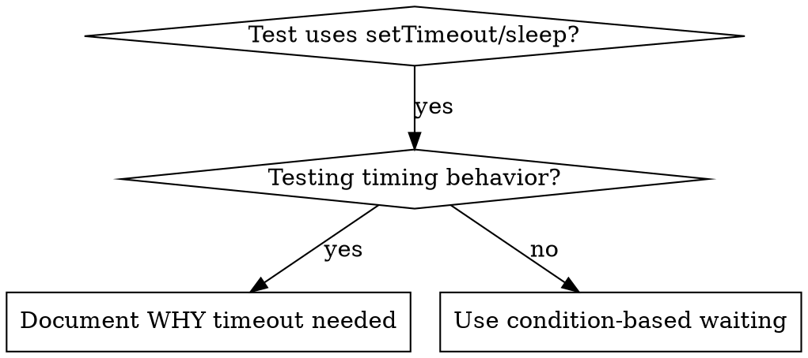

# Condition-Based Waiting

## 概览

Flaky tests 往往会用武断的延迟去猜测时序。这会制造 race conditions：在快机器上通过，但在高负载或 CI 中失败。

**核心原则：** 等待你真正关心的条件，而不是猜测它大概要花多久。

## 何时使用



**适用于：**
- 测试里出现了武断延迟（`setTimeout`、`sleep`、`time.sleep()`）
- 测试不稳定（有时通过，在负载下失败）
- 并行运行时测试会超时
- 需要等待异步操作完成

**不适用于：**
- 测试真正的时序行为（如 debounce、throttle 间隔）
- 如果必须用武断 timeout，一定要说明 **WHY**

## 核心模式

```typescript
// ❌ BEFORE: Guessing at timing
await new Promise(r => setTimeout(r, 50));
const result = getResult();
expect(result).toBeDefined();

// ✅ AFTER: Waiting for condition
await waitFor(() => getResult() !== undefined);
const result = getResult();
expect(result).toBeDefined();
```

## 快速模式

| 场景 | 模式 |
|----------|---------|
| 等待事件 | `waitFor(() => events.find(e => e.type === 'DONE'))` |
| 等待状态 | `waitFor(() => machine.state === 'ready')` |
| 等待数量 | `waitFor(() => items.length >= 5)` |
| 等待文件 | `waitFor(() => fs.existsSync(path))` |
| 复杂条件 | `waitFor(() => obj.ready && obj.value > 10)` |

## 实现

通用轮询函数：
```typescript
async function waitFor<T>(
  condition: () => T | undefined | null | false,
  description: string,
  timeoutMs = 5000
): Promise<T> {
  const startTime = Date.now();

  while (true) {
    const result = condition();
    if (result) return result;

    if (Date.now() - startTime > timeoutMs) {
      throw new Error(`Timeout waiting for ${description} after ${timeoutMs}ms`);
    }

    await new Promise(r => setTimeout(r, 10)); // Poll every 10ms
  }
}
```

完整实现请查看本目录中的 `condition-based-waiting-example.ts`，其中包含来自真实调试会话的领域专用 helper（`waitForEvent`、`waitForEventCount`、`waitForEventMatch`）。

## 常见错误

**❌ 轮询过快：** `setTimeout(check, 1)` - 浪费 CPU  
**✅ 修正：** 每 10ms 轮询一次

**❌ 没有 timeout：** 如果条件永远不满足，会无限循环  
**✅ 修正：** 始终带上 timeout，并提供清晰错误信息

**❌ 使用陈旧数据：** 在循环外缓存状态  
**✅ 修正：** 在循环内部调用 getter，获取最新数据

## 何时使用武断 timeout 才是正确的

```typescript
// Tool ticks every 100ms - need 2 ticks to verify partial output
await waitForEvent(manager, 'TOOL_STARTED'); // First: wait for condition
await new Promise(r => setTimeout(r, 200));   // Then: wait for timed behavior
// 200ms = 2 ticks at 100ms intervals - documented and justified
```

**要求：**
1. 先等待触发条件出现
2. 基于已知时序，而不是猜测
3. 用注释解释 **WHY**

## 真实世界影响

来自调试会话（2025-10-03）：
- 修复了 3 个文件中的 15 个 flaky tests
- 通过率：60% → 100%
- 执行时间：快了 40%
- 不再出现 race conditions
