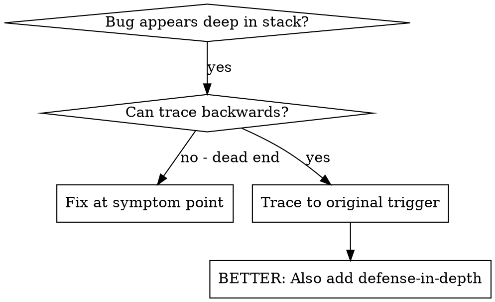
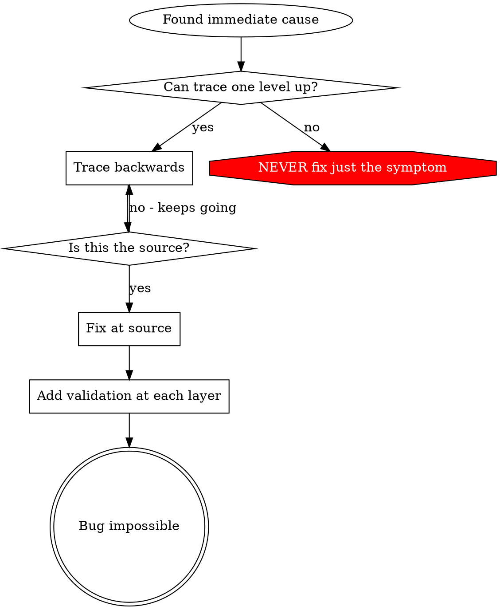

# Root Cause Tracing

## 概览

Bug 往往会在调用栈很深的地方表现出来（例如在错误目录里执行 `git init`、在错误位置创建文件、用错误路径打开数据库）。你的直觉会想在报错点修它，但那只是在处理 symptom。

**核心原则：** 沿着调用链向后追溯，直到找到最初触发它的地方，然后在源头修复。

## 何时使用



**适用于：**
- 错误出现在执行深处（而不是入口点）
- Stack trace 显示出很长的调用链
- 不清楚无效数据最初来自哪里
- 需要找出是哪一个 test / 哪段代码触发了问题

## 追踪流程

### 1. 观察 symptom
```
Error: git init failed in ~/project/packages/core
```

### 2. 找到直接原因
**是什么代码直接导致了这个问题？**
```typescript
await execFileAsync('git', ['init'], { cwd: projectDir });
```

### 3. 问：是谁调用了它？
```typescript
WorktreeManager.createSessionWorktree(projectDir, sessionId)
  → called by Session.initializeWorkspace()
  → called by Session.create()
  → called by test at Project.create()
```

### 4. 继续向上追
**传进去的值是什么？**
- `projectDir = ''`（空字符串！）
- 作为 `cwd` 的空字符串会解析为 `process.cwd()`
- 那正是源码目录！

### 5. 找到原始触发点
**空字符串来自哪里？**
```typescript
const context = setupCoreTest(); // Returns { tempDir: '' }
Project.create('name', context.tempDir); // Accessed before beforeEach!
```

## 添加 Stack Trace

当你无法手工追踪时，就加 instrumentation：

```typescript
// Before the problematic operation
async function gitInit(directory: string) {
  const stack = new Error().stack;
  console.error('DEBUG git init:', {
    directory,
    cwd: process.cwd(),
    nodeEnv: process.env.NODE_ENV,
    stack,
  });

  await execFileAsync('git', ['init'], { cwd: directory });
}
```

**关键：** 在 tests 中使用 `console.error()`（不要用 logger - 可能不会显示）

**运行并抓取：**
```bash
npm test 2>&1 | grep 'DEBUG git init'
```

**分析 stack traces：**
- 查找 test 文件名
- 找到触发调用的行号
- 识别模式（是不是同一个 test？是不是同一类参数？）

## 找出是哪一个测试造成了污染

如果某种污染只会在 tests 中出现，但你不知道是哪一个 test 导致的：

使用本目录中的二分脚本 `find-polluter.sh`：

```bash
./find-polluter.sh '.git' 'src/**/*.test.ts'
```

它会逐个运行测试，在发现第一个 polluter 时停止。具体用法见脚本本身。

## 真实示例：空的 projectDir

**Symptom：** `.git` 被创建在 `packages/core/`（源码目录）

**追踪链路：**
1. `git init` 在 `process.cwd()` 中运行 ← cwd 参数为空
2. WorktreeManager 被传入空的 projectDir
3. Session.create() 传入了空字符串
4. Test 在 beforeEach 之前访问了 `context.tempDir`
5. setupCoreTest() 初始返回 `{ tempDir: '' }`

**Root cause：** 顶层变量初始化时访问了空值

**Fix：** 把 tempDir 改成 getter，并在 beforeEach 之前访问时直接抛错

**另外还加入了 defense-in-depth：**
- Layer 1: `Project.create()` 校验目录
- Layer 2: `WorkspaceManager` 校验非空
- Layer 3: `NODE_ENV` guard 在测试时拒绝在 tmpdir 外执行 `git init`
- Layer 4: `git init` 前记录 stack trace

## 关键原则



**绝不要只修错误出现的位置。** 要往回追，直到找到原始触发点。

## Stack Trace 小贴士

**在 tests 中：** 用 `console.error()`，不要用 logger - logger 可能会被抑制  
**在操作前记录：** 要在危险操作之前记录，不要等失败后才记  
**记录上下文：** 目录、cwd、环境变量、时间戳  
**捕获 stack：** `new Error().stack` 能显示完整调用链

## 真实世界影响

来自调试会话（2025-10-03）：
- 通过 5 层追踪找到了 root cause
- 在源头完成修复（getter validation）
- 添加了 4 层防御
- 1847 个测试通过，零污染
